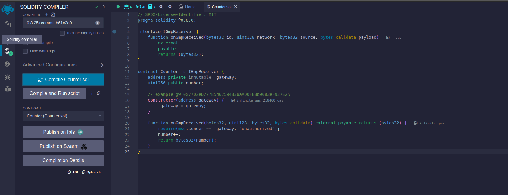
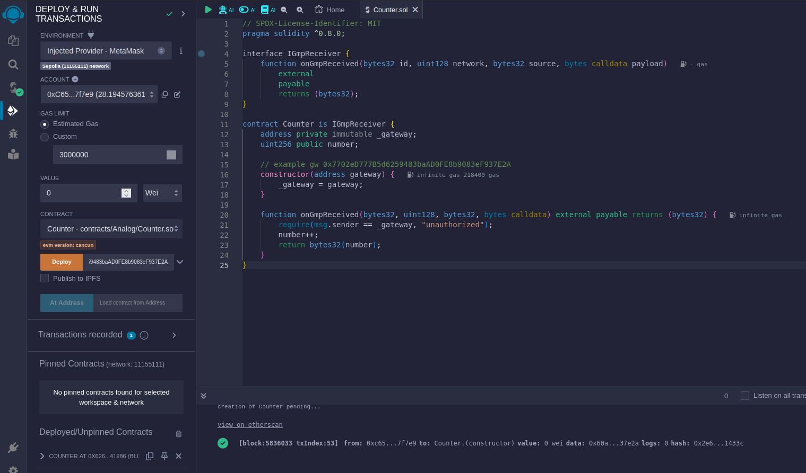
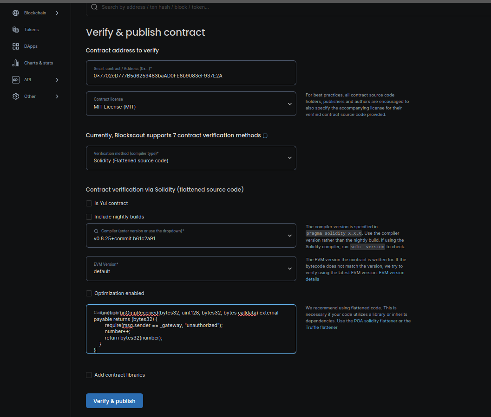
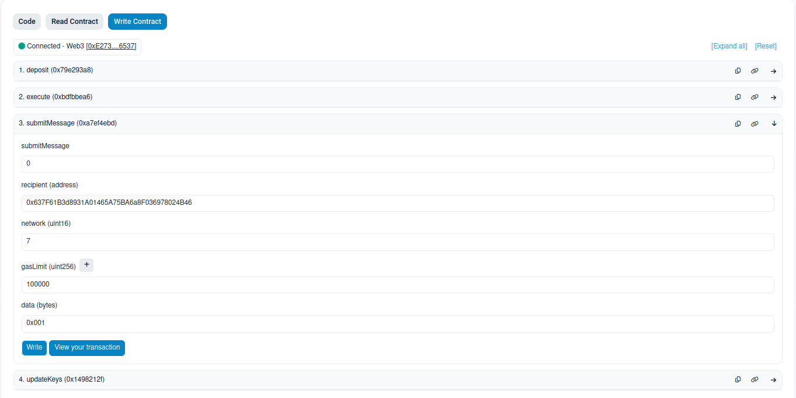

# GMP

## Build and deploy a smart contract using Analog GMP interfaces on Sepolia 

### Build and Deploy

1. Открываем сайт https://remix.ethereum.org

2. Создаем новый файл [Counter.sol](https://github.com/madest92/analog-testnet/blob/main/gmp/Counter.sol)

3. Переходим во вкладку "Solidity compiler"

    * Жмем **"Compile Counter.sol"**, использую версию компилятора 0.8.25

    

4. Переходим в вкладку **"Deploy"**

    * В поле Environment выбираем Metamask. (!) Обязательно проверьте, что в Metamask выбрана сеть Sepolia

    * В поле **"adress gateway"** указываем **0x7702eD777B5d6259483baAD0FE8b9083eF937E2A** 

    * Жмем **"Deploy"**, подтвержаем транзакцию. После копируем адрес контракта в **"Deployed/Unpinned Contracts"** внизу слева

    

### Verified

1. Открываем сайт https://eth-sepolia.blockscout.com/contract-verification

    * Вписываем адрес смарт контракта

    * Лицензия MIT

    * Метод верификации: Solidity(Flattened source code)

    * Версия компилятора: 0.8.25

    * Версия EVM: default

    * Убираем галочку с оптимизации

    * Вставляем тот же самый код из файла Counter.sol

    * Ждем Verify

    

## Send a message using a GMP gateway contract

1. Открываем страницу https://sepolia.etherscan.io/address/0xB5D83c2436Ad54046d57Cd48c00D619D702F3814#writeContract

2. Подключаем метамаск(Connect to web3) и открываем submitMessage

3. Вводим данные

    * submitMessage - 0

    * recipient (address) - your address

    * network - 7

    * gasLimit - 100000

    * data - 0x001
    
    

4. Жмем **Write** и затем **View your transaction**, чтобы получить id транзакции для подтверждения
