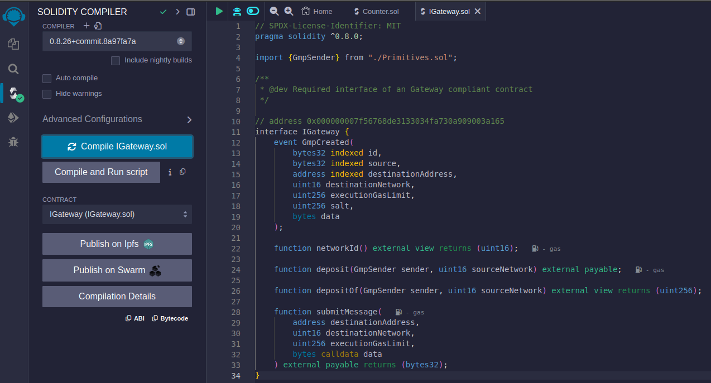
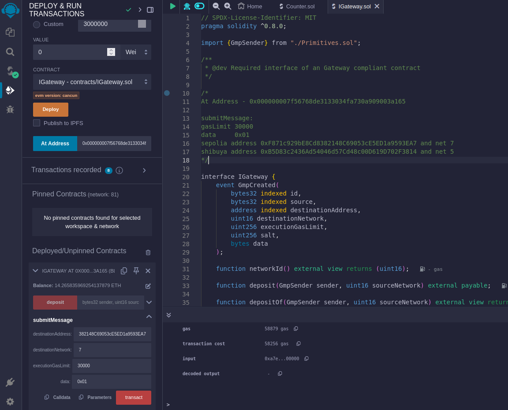
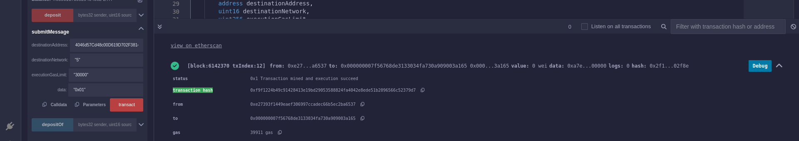

# GMP

## Build and deploy a smart contract using Analog GMP interfaces on Sepolia 

### Build and Deploy

1. Открываем сайт https://remix.ethereum.org

2. Создаем новый файл [Counter.sol](https://github.com/madest92/analog-testnet/blob/main/gmp/Counter.sol)

3. Переходим во вкладку "Solidity compiler"

    * Жмем **"Compile Counter.sol"**, использую версию компилятора 0.8.26

    

4. Переходим в вкладку **"Deploy"**

    * В поле Environment выбираем Metamask. (!) Обязательно проверьте, что в Metamask выбрана сеть Sepolia

    * В поле **"adress gateway"** указываем **0x000000007f56768de3133034fa730a909003a165**

    * Жмем **"Deploy"**, подтвержаем транзакцию. После копируем адрес контракта в **"Deployed/Unpinned Contracts"** внизу слева

    

### Verified

1. Открываем сайт https://eth-sepolia.blockscout.com/contract-verification

    * Вписываем адрес смарт контракта

    * Лицензия MIT

    * Метод верификации: Solidity(Flattened source code)

    * Версия компилятора: 0.8.26

    * Версия EVM: default

    * Убираем галочку с оптимизации

    * Вставляем тот же самый код из файла Counter.sol

    * Ждем Verify

    

## Build and deploy a smart contract using Analog GMP interfaces on Shibuya

Все тоже самое как в Sepolia, только выбираем сеть **Shibuya** и ссылка верификации [эта](https://shibuya.blockscout.com/contract-verification)

Если нет тестовых токенов, то их можно получить [тут](https://portal.astar.network/shibuya-testnet/assets)

## Send a message using a GMP gateway contract on Sepolia

1. Открываем сайт https://remix.ethereum.org

2. Загружаем 3 файла [IGateway.sol](https://github.com/madest92/analog-testnet/blob/main/gmp/IGateway.sol) [Primitives.sol](https://github.com/madest92/analog-testnet/blob/main/gmp/Primitives.sol) [BranchlessMath.sol](https://github.com/madest92/analog-testnet/blob/main/gmp/BranchlessMath.sol)

3. Переходим во вкладку "Solidity compiler"

    * Жмем **"Compile IGateway.sol"**, использую версию компилятора 0.8.26

    

4. Переходим в вкладку **"Deploy"**

    * В поле Environment выбираем Metamask. (!) Обязательно проверьте, что в Metamask выбрана сеть Sepolia

    * В поле **"adress gateway"** указываем **0x000000007f56768de3133034fa730a909003a165**

    * Жмем **"At Address"**

4.1. Вводим данные для **submitMessage** внизу слева в **"Deployed/Unpinned Contracts"**

    * destinationAddress - 0xF871c929bE8Cd8382148C69053cE5ED1a9593EA7

    * destinationNetwork - 7

    * executionGasLimit - 30000

    * data - 0x01
    
    

4.2. Жмем **transact** и подтвержаем транзакцию в метамасте. После находим **transaction hash**

    

## Send a message using a GMP gateway contract on Shibuya

Все тоже самое как в Sepolia, только выбираем сеть **Shibuya** в метамаске и используем следующие данные:

    * destinationAddress - 0xB5D83c2436Ad54046d57Cd48c00D619D702F3814

    * destinationNetwork - 5

    * executionGasLimit - 30000

    * data - 0x01
 
