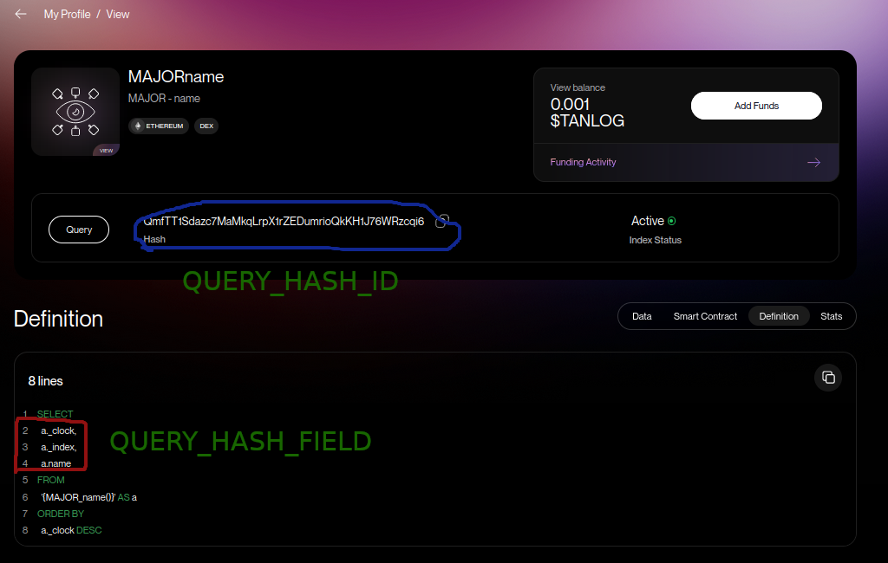

# View gets queried by SDK

## Подготовка окружения

Скачиваем данный проект. Копируем env файл и настраиваем окружение в файле

```
cp .env-example .env
```

- **WALLET_SUBSTRATE_ADDRESS** адрес Substrate кошелька

- **WALLET_SEED** seed фраза данного кошелька

- **QUERY_HASH_ID** хеш вашего профинансированного представления. Найти можно в [профиле](https://watch.testnet.analog.one/#/profile) во вкладке **Funded Views**

- **QUERY_HASH_FIELD** поле которые хотим вывести. Найти можно в **Definition** представления

Пример для QUERY_HASH:

QUERY_HASH_ID="QmfTT1Sdazc7MaMkqLrpX1rZEDumrioQkKH1J76WRzcqi6" и QUERY_HASH_FIELD="name"



## Запуск

Есть 2 варианта запуска, в докере и без

### Без докера

Устанавливаем [Node](https://docs.npmjs.com/downloading-and-installing-node-js-and-npm) если еще не установлен

Затем создаем сессионный ключ.
```
npm i
node ssk.mjs
```

И делаем запрос нашего представления
```
node query.mjs
```

### Использую докер

Устанавливаем [Docker](https://docs.docker.com/engine/install/), если еще не установлен

И запускаем скрипт run.sh в консоли

```
✗ ./run.sh                           
20-alpine: Pulling from library/node
4abcf2066143: Pull complete 
d1e2f2d8a178: Pull complete 
3badf7a80ed4: Pull complete 
a0bb3a80cd3b: Pull complete 
Digest: sha256:fac6f741d51194c175c517f66bc3125588313327ad7e0ecd673e161e4fa807f3
Status: Downloaded newer image for node:20-alpine
docker.io/library/node:20-alpine

added 36 packages, and audited 37 packages in 4s

4 packages are looking for funding
  run `npm fund` for details

found 0 vulnerabilities
npm notice 
npm notice New minor version of npm available! 10.5.2 -> 10.7.0
npm notice Changelog: https://github.com/npm/cli/releases/tag/v10.7.0
npm notice Run npm install -g npm@10.7.0 to update!
npm notice 
The SESSION_KEY has been updated successfully.
The .apikeys file has been created successfully.
[]
```
